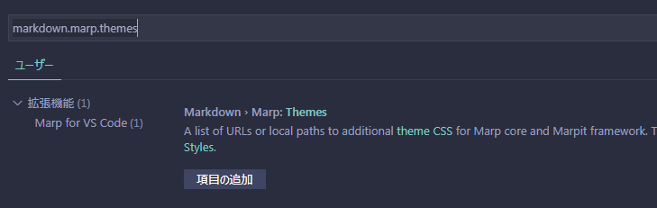
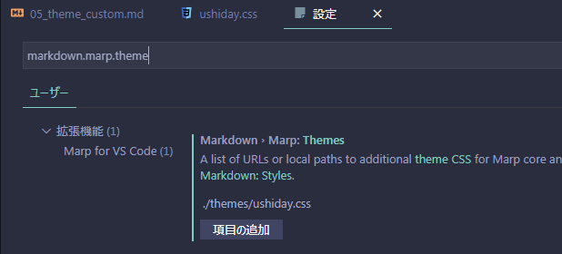

# ushiday marp
Marp = mdよりスライドを作成するプラグイン
## (05) カスタムテーマ

作成日 : 2020.07.08  **(ushiday)**

---
# カスタムテーマを追加
Marpのデフォルト同梱テーマは3種類。`default`,`gaia`,`uncover`
カスタムテーマを使用するためには**VSCode**の`setting.json`に追記が必要。
VS Codeの、`ファイル> ユーザー設定> 設定` または、`Ctrl+,` から、`settings.json`を開く。
次に検索窓へ、`markdown.marp.themes`と入力し、インクリメンタルに要素が検索され、以下の表示になる。

`項目追加`を押して、テーマCSSファイルへのパスを入力する。e.g. `./themes/ushiday.css`
今後、複数のテーマを作ったら、追加していくことが可能。また、インターネット上のパスを指定することも可能。

---
# VSCode 設定後

---
# カスタムテーマを使用する

- 用意した、`css`のアノテーションで指定した名前を`theme`で指定する。
- `class`で、適用するスタイルを指定する

---
<!--
class: title
-->
# カスタムテーマを適用したスライド1
このスライドには`title`クラスを使用している。

---
<!--
class: slides
-->
# カスタムテーマを適用したスライド2
## カスタムテーマを適用したスライド2
このスライドには`slieds`クラスを使用している。

