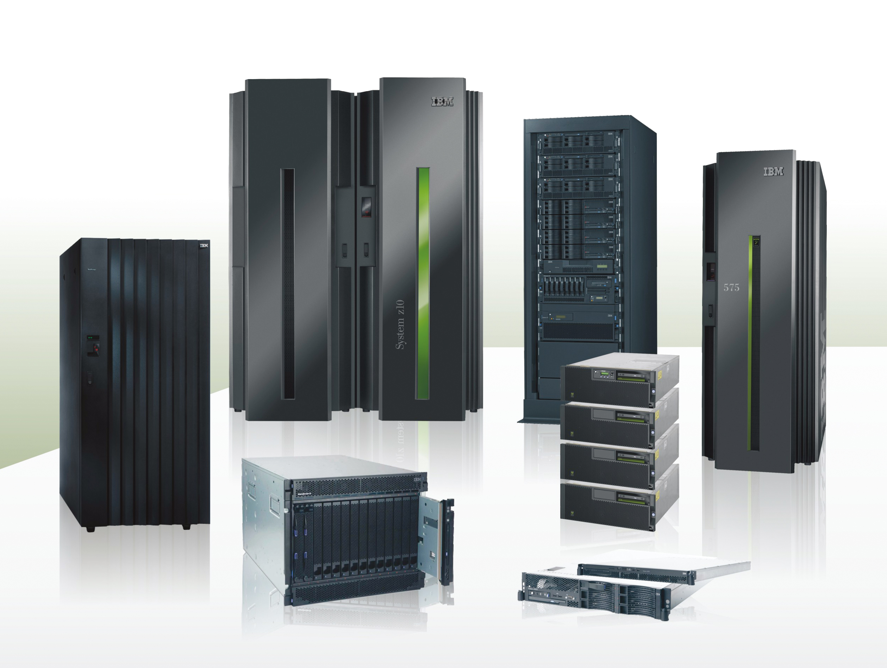
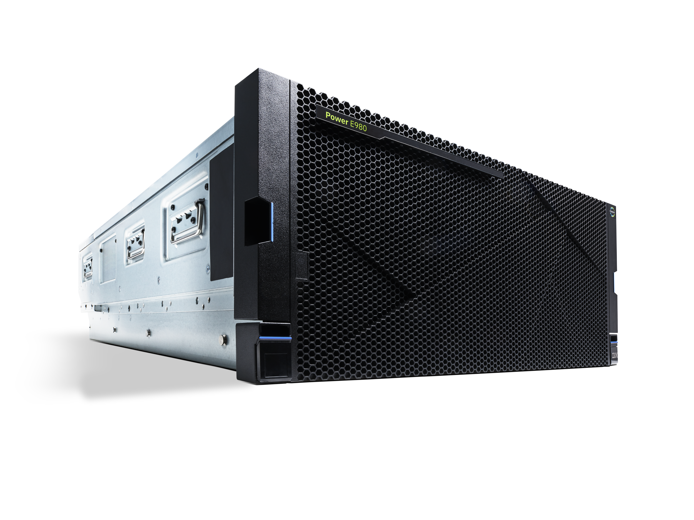

<!--
_color: white
footer: 'ushiday@Chubu System Co.,Ltd.'
paginate: true
-->

# ushiday marp
Marp = mdよりスライドを作成するプラグイン
## (50) ushiday Marpを試す

`bg brightness`を使うと背景の透過を変更出来る

作成日 : 2020.07.08  **(ushiday)**

---

## 左に画像を挿入
`bg left`で左に画像を差し込む

- 表示場所、比率を指定する

---

<!--
_backgroundColor: white
-->

# CSC は
#### IBM i と

共に進む…